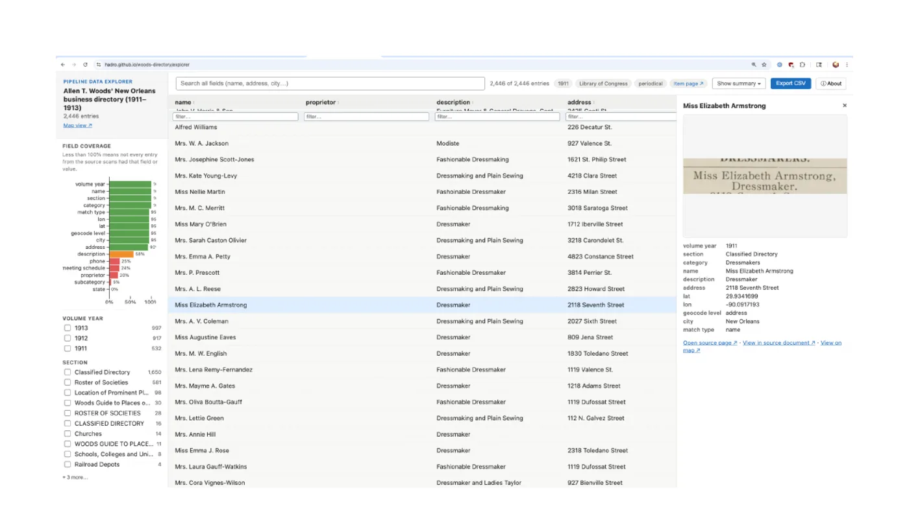
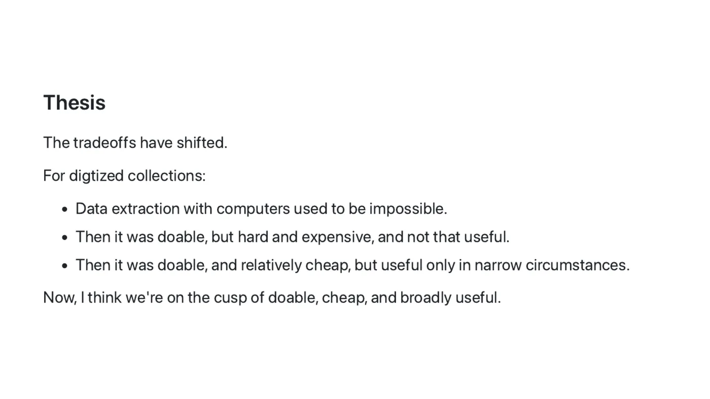
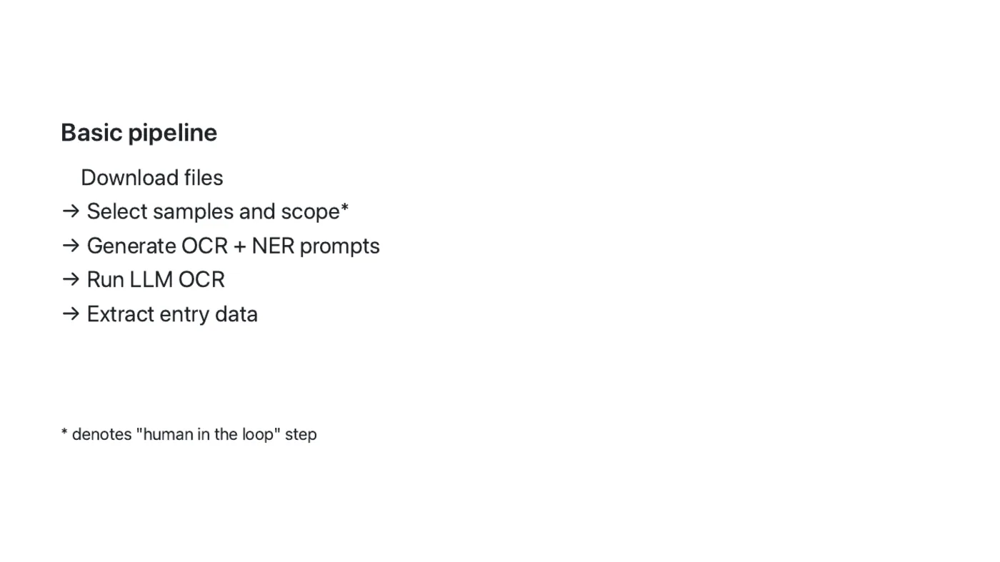
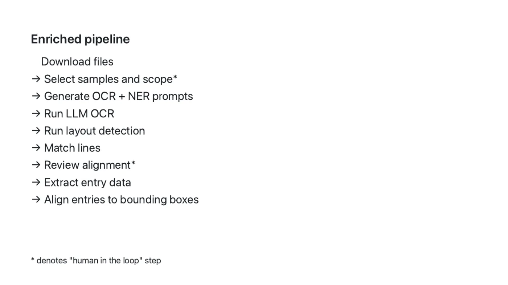
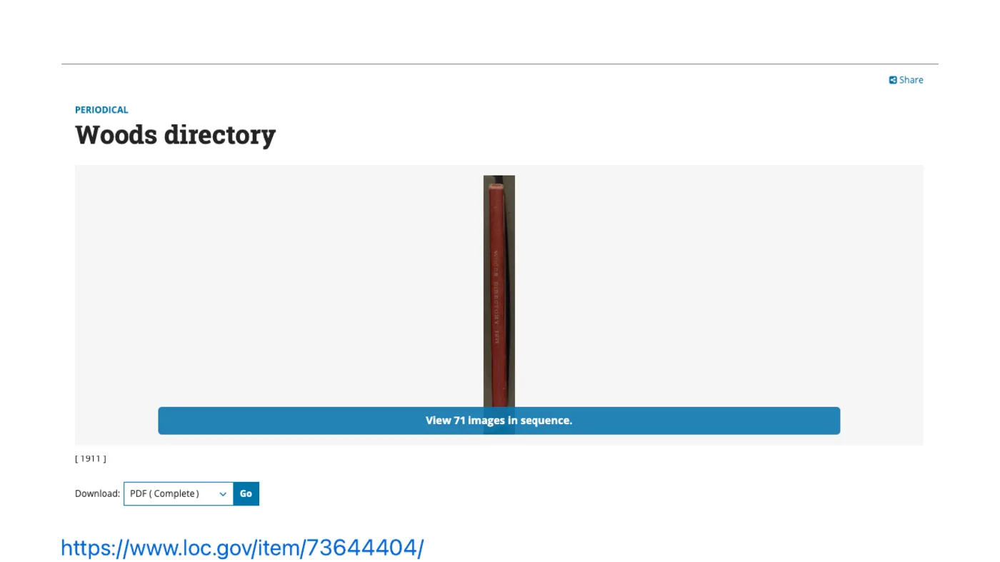
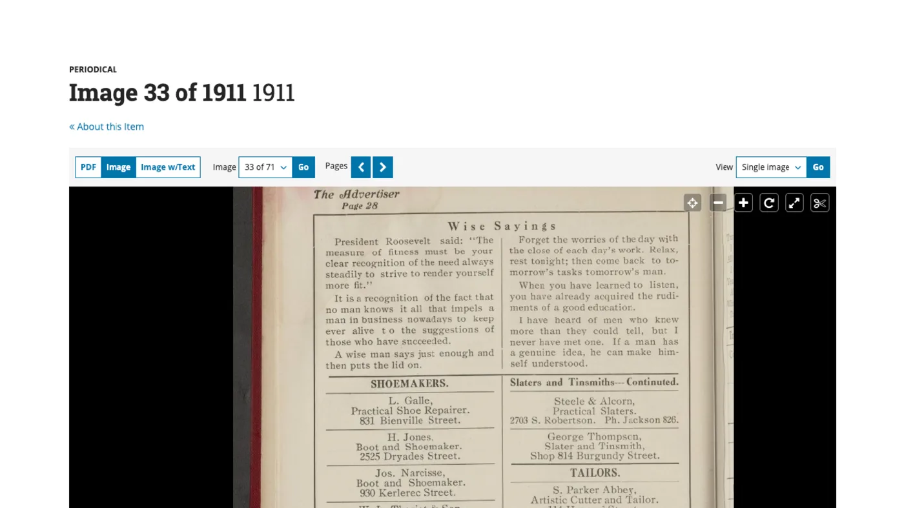
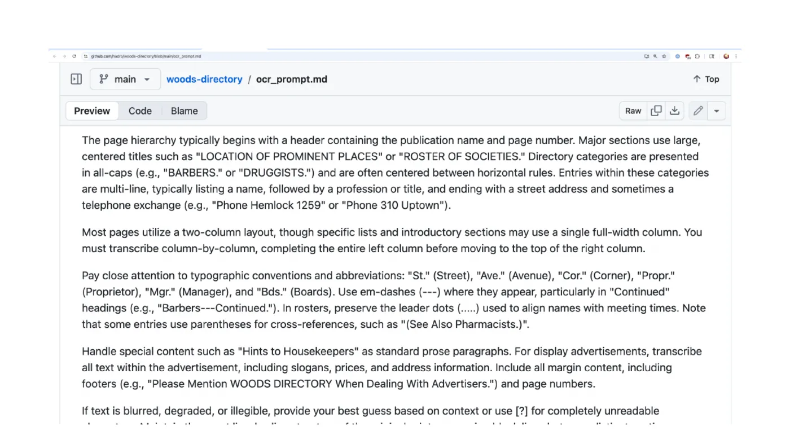
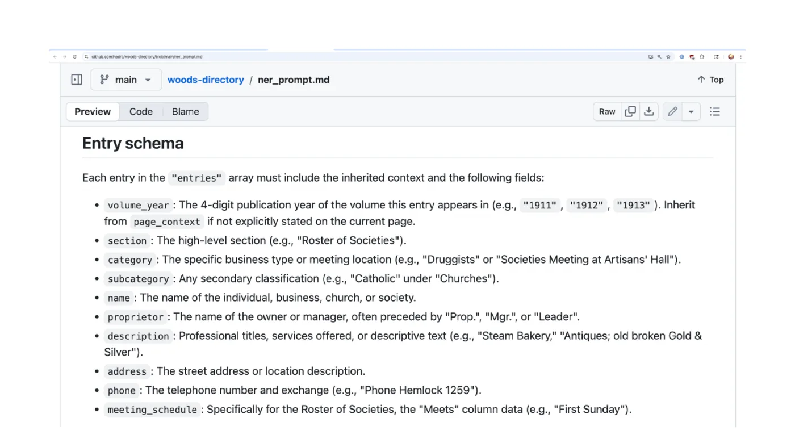
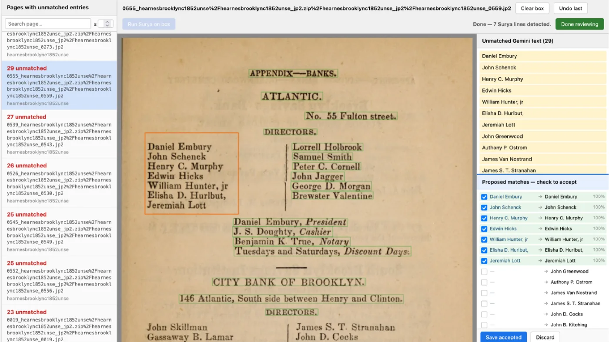

The folks at CNI recently saw a message I wrote on a private email list about the work I'm doing on my "Directory Pipeline," and they very graciously invited me to record a brief presentation on it for the Spring 2026 CNI video briefs series.

It was a great opportunity to lay out some of the underlying ideas I've been thinking about, and show some basic demos of what the Directory Pipeline can output.

The repo is at [https://github.com/hadro/directory-pipeline/](https://github.com/hadro/directory-pipeline/).

The example I focus on in the slides is the [Woods Directory Data Explorer](https://hadro.github.io/woods-directory/explorer#about).

The [post is now live](https://www.cni.org/topics/special-collections/directory-pipeline-a-tool-for-turning-historical-digital-collections-into-structured-data), with video embedded below, and [the slides are also available](https://www.cni.org/wp-content/uploads/2026/03/Hadro-Directory-Pipeline-Spring-2026.pdf).

<iframe width="560" height="315" src="https://www.youtube-nocookie.com/embed/SFvmz0wIwpg?si=iaqOZvy9A0jgMTP8" title="YouTube video player" frameborder="0" allow="accelerometer; autoplay; clipboard-write; encrypted-media; gyroscope; picture-in-picture; web-share" referrerpolicy="strict-origin-when-cross-origin" allowfullscreen></iframe>

---

For anyone who'd rather read than watch, here's a written version of the twenty minutes, with the slides dropped in where they belong.

One thing I say at the top of the video and will repeat here: I work for the Library of Congress, in the Digital Strategy Directorate, but this is a personal digital collections project. It's a nights-and-weekends thing, and not by any means an official output of the Library of Congress.

## What the pipeline does

The pipeline takes any digitized item that has a [IIIF manifest](https://iiif.io/get-started/how-iiif-works/) — it's built specifically for directory-like objects — and runs it through a series of LLM-augmented steps to produce structured data.

The primary output is a web page with a data explorer on it, basically a CSV viewer. Every row corresponds to an entry in the underlying work: if it's a city directory, each row is a person listed in that directory, and each column is one of the data fields associated with that entry.

Very importantly, every entry in the explorer also carries an image of the underlying entry itself. This isn't an abstracted data effort at all; it stays rooted in the image of the text, for verification and for all the other things that turn out to be useful to researchers.

That's the [Woods Directory](https://hadro.github.io/woods-directory/explorer#about), which I'll come back to — a directory of Black-owned and Black-serving businesses in New Orleans in 1911 and the 19-teens. The entry I've selected is Miss Elizabeth Armstrong, a dressmaker on Seventh Street. On the right is everything the pipeline extracted; at the top is the image of the entry heading itself. That's true for every entry in the work.

## The two things I most want to highlight

**Meta-prompting.** The pipeline asks the user to select a handful of example pages from a given work, then asks the LLM to look at those samples and design its own prompts — the OCR prompt for text extraction, and the NER prompt for data extraction. The model writes the prompts that will work best for that specific item.

**A two-pass OCR strategy.** Older OCR tools are very good at bounding boxes, but the text quality can be hit or miss on certain kinds of materials. The newer, LLM-driven tools are extremely high quality — they're doing handwriting recognition at really low error rates — but you can't get bounding boxes out of them. So I take the bounding boxes from the older tools, the text from the newer ones, and use a post-alignment step that does a very nice job of sewing the two together.

## What it's for, and what it isn't

This is for directories, gazetteers, and similarly structured works. Those are easy for people to read, but a lot of the information in them is latent in the *structure* of the page — headings that carry across pages, ditto marks, and all the other typographic conventions publishers used. That structure has historically been very difficult to handle for data extraction purposes, and the pipeline works really well across those cases.

It's less useful for generalized tabular data that happens to appear in print works. But it does work well for handwritten documents: if you have manuscript material with entries or entry-like items in handwriting, this does nicely in my testing.

## The thesis

The tradeoffs have really shifted, and there's been a genuine sea change in the last few months especially.

For digitized collections, this kind of data extraction used to be basically impossible. Then it was possible but hard and expensive, and therefore not that useful. Then it got more doable — you could run it on commodity hardware — but the NLP tooling of that era was only useful in fairly narrow circumstances, and certainly couldn't be pointed at arbitrary items in our digital collections.

I think we're now on the cusp of tooling that can apply data extraction to essentially arbitrary works in our digitized collections.

I mention OCR a lot, because that's the frame I keep coming back to. As an industry we decided many years ago that, despite the flaws in the OCR we generate, it was valuable to present it to users in many — maybe most — cases. I think there are similar opportunities here. We'll never get 100% accuracy. But if we treat this as a supplement and an augmentation, the way we treat OCR, there's a lot of room to think broadly about how it could serve researchers and patrons. For many of our materials, "is this useful despite its flaws?" is getting closer to yes.

## Background: Navigating the Green Book

The background here is a project I was lucky to work on at the New York Public Library: [Navigating the Green Book](https://beefoo.github.io/greenbook-map/), developed by the very talented developer and designer Brian Foo, who took data from the Green Books and built a mapping interface so people could experience the data of this artifact of segregation through modern mapping tools.

My part was the data extraction. In 2016, as much as we wanted it, that was very hard to do — it ended up being a manual transcription effort, with some crowdsourcing tools, but manual all the same.

Being able to get the data out of all those volumes coherently is something I've wanted to work on for ten or twelve years. I think the tools are finally there to do it responsibly.

## The steps

The basic pipeline takes the IIIF item, downloads the images, prompts you to select samples, generates the item-specific OCR and data extraction prompts from those samples, and then runs the recognition and extraction steps and hands you the results.

The enriched version adds bounding box detection, and then aligns everything together — which is what produces the entry-level images in the explorer I showed at the start.

And then the fun stuff: data explorers, map interfaces after a geocoding step (for anything with an address field, where the underlying geography hasn't shifted too much), and cross-volume comparison, so you can surface entries that appear across multiple editions of a work and build interfaces around that.

## The Woods Directory, in depth

The [Woods Directory](https://www.loc.gov/item/73644404/) is an incredible resource: Black and minority owned and serving businesses in New Orleans, with the 1911, 1912, and 1913 editions digitized by the Library of Congress. It was one of the items I was studying while developing the pipeline.

And here's what a page looks like:

That layout — a headline cutting across two columns, then two columns of prose, then two columns of entries — is exactly the sort of thing that trips up older generations of extraction tools.

But here's the part I really want to highlight. While reading around about how the Woods Directory has been written about and used, I found a post [a genealogist wrote in 2013](https://www.creolegen.org/2013/02/28/woods-directory-2/), before these volumes were digitized. Like a lot of posts about reference works like this, it generated real interest: the comments are full of people talking about their own relatives whose businesses were listed in the directory, or whose photographs appeared in its advertisements. People hoping to find some way to see items held in a couple of research libraries — emailing each other cellphone photos of hard copies in private hands.

Take any of the names in those comments, drop them into the pipeline output, and you find them immediately.

Search for "funeral," and one of the comments points you to the Boyer & Taylor Co. entry. Click through from the entry image and you get a IIIF viewer that takes you to the full page context — where you can see the names, and the pictures of the people named in that blog post. In this case Ella P. Taylor and Raoul J. Llopis, both associated with the Boyer & Taylor funeral company. ([Here's that search.](https://hadro.github.io/woods-directory/explorer#q=Raoul))

That's one example from one reference work, and it took seconds. There are so many cases like that across all the directories and city guides and phone books we digitize and make available as research libraries.

## How the prompts figure in

Here's the meta-prompting in practice, again with the Woods Directory. I picked a few sample pages and asked the model to generate the OCR prompt it thought would best extract the text, and then the data extraction prompt for pulling entries out of that text.

You can see it describing the layouts and their quirks: that it's most commonly a two-column layout; that the material at the top of the page sometimes cuts across the columns and should be recorded as prose paragraphs; that the actual entries appear further down. A little bit of prompting like this goes a very long way. ([The full OCR prompt is here.](https://github.com/hadro/woods-directory/blob/main/ocr_prompt.md))

That feeds the item-specific data extraction prompt, which generates a schema specific to the work: volume year, section, category and subcategory, name, proprietor (sometimes distinct from the name), address, phone numbers, and — usefully for this kind of directory — meeting schedules. For any other work passed through the pipeline, this schema would look completely different. ([The full entity extraction prompt is here.](https://github.com/hadro/woods-directory/blob/main/ner_prompt.md))

## The human in the loop

This is the interface that asks you to select example pages for prompt generation. You want representative pages — and if there's a page with a key describing what appears in the work, that's the one to grab.

And this is the alignment view, for reviewing how the older bounding boxes line up with the newer OCR. If it misses a section you can draw boxes and trigger another round of OCR. Generally the alignment works extremely well; I review it, but I'm not doing much custom work in here.

## The actors in this pipeline

I talk a lot about what the LLMs are doing, so it's worth being explicit about the division of labor.

**What a human is doing:** bringing curiosity to bear. Exhibiting agency and responsibility. Employing materials judgment and expertise. Model selection. Prompt review. QA — OCR quality, alignment review, gut checks. And synthesizing, understanding, and getting excited about the possibilities.

**What an LLM is doing:** meta-prompting for prompt generation (OCR and NER). Item-specific OCR extraction. Handwriting detection — if it spots manuscript material, it kicks it to a higher-quality model so the recognition is handled capably. And item-specific data extraction.

**What a plain old computer is doing:** file management. Spread detection (microfilm with 2-up pages, for instance). Column detection. Layout analysis. Bounding box identification. Outlier detection. Aligning the LLM OCR to the bounding boxes. And generating the IIIF annotations and content state — all the plain old scripting we've appreciated from our computers for decades.

## Other outputs, and what's next

Other things I've run through the pipeline: [the Green Books](https://hadro.github.io/green-books/explorer) travel guides, and a [series of brewery guides](https://hadro.github.io/brewery-guides/explorer#about) — business directories of breweries and maltsters from the late 19th and early 20th centuries.

I've been using Gemini for the OCR and data extraction, and it's a great balance of capability and cost. But the next phase I want to look into is doing this almost entirely locally, with smaller models like Qwen 3.5 running on commodity hardware. I think it's probably possible, especially in the coming months, to take the paid API out of this entirely.

If any of that is interesting to you, please get in touch — I'm happy to steer this research and exploration toward things that would be useful to other people.

*And the disclosure I gave at the end of the video: I use Claude Code to write code, and Gemini for the data extraction, but I wrote all of the material for the presentation itself. No AI was used in the creation of those slides, for better or for worse.*
