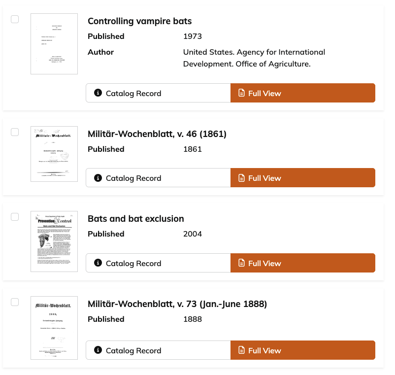
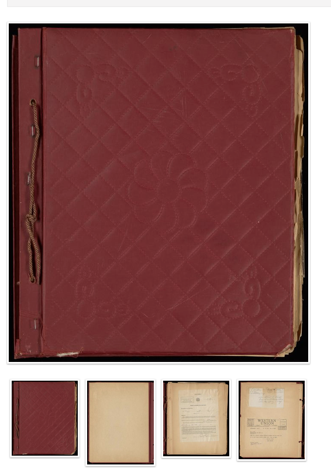
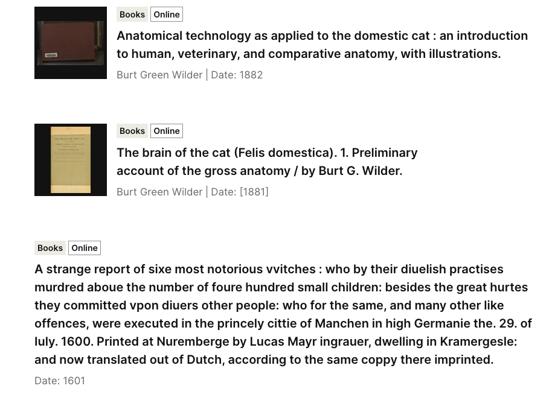
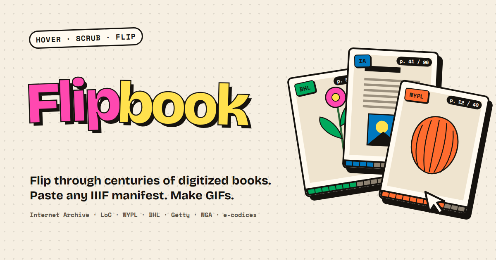
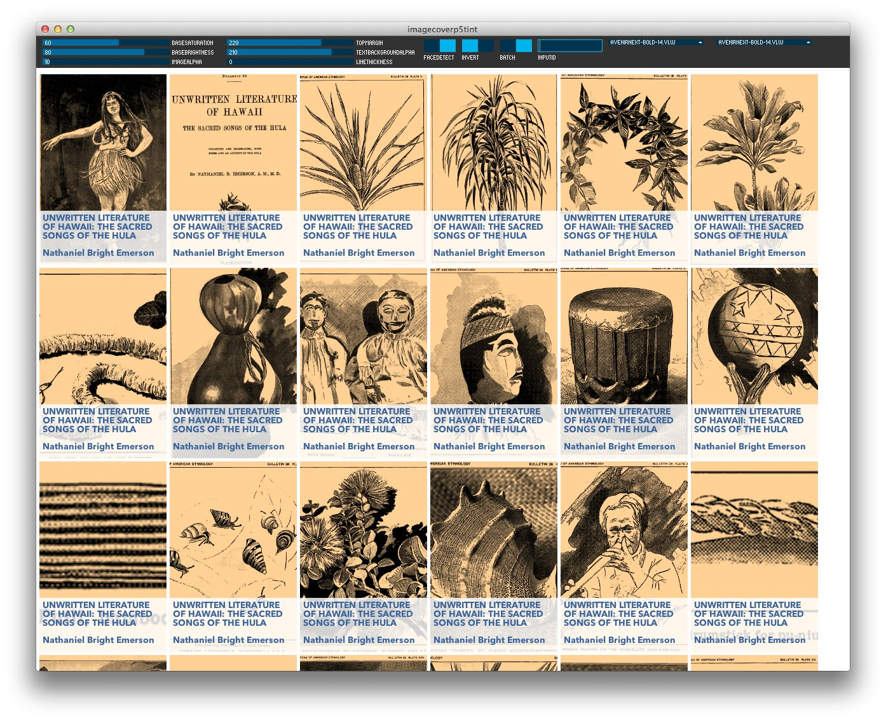

TLDR: If you just want to see the fun project, take a look at the Flipbook tool I built:
- <https://hadro.github.io/flipbook/>

<video src="img/flipbook-demo.mp4" poster="img/flipbook-demo-poster.jpg" muted playsinline controls></video>
*Scrubbing through the Voynich manuscript on the Flipbook shelf, then opening it and making a GIF.*

---

## The question

How do you represent an entire digitized book when all you have is space for a single thumbnail image?

The obvious answer: show the cover. 

This works fine for recent books — publishers provide cover illustrations, the user sees more or less what the book would look like if they had it in hand, and we all go about our day. This is how commercial ebook operations work, and it's the reason we don't run into issues like the ones I list below in places like Amazon or Bookshop.org, or in public library ebook catalogs.

But consider most research library contexts:
What if the work never had a cover of its own? Many manuscripts were bound at some point, often in relatively plain animal-hide covers that have no visual or descriptive relationship to the contents of the item.

Or what if a cover is intentionally boring and blank? 
For centuries, libraries have rebound books for shelf stability, typically with plain, unadorned cloth or leather covers[^1]. 

This was the right call for preservation, but we unwittingly created a monster problem that would emerge only decades later in the era of mass digitization: The first image shown is usually the cover, and it's often the _least_ interesting digitized page of a work.

So how do you give a user a useful glimpse into what lies within the pages?

*Biodiversity Heritage Library volumes in Internet Archive search results. Half of the thumbnails are plain library bindings.*

## A challenge for digital libraries

This has been a digital library struggle for decades. There are various solutions different orgs have come up with, none of them perfect: 
- You can just not take pictures of the cover, and start with the first page that seems like it would be of interest. Most cultural heritage digitization these days strives for the "complete object" approach, and this practice seems less common than it was, but there are many examples out there and we're all just doing our best.
- You can take pictures of the covers, then move the image of the cover to the back of the image order, so while you've still photographed the front, it doesn't appear first.[^2]
- You can choose an arbitrary image and designate it a "cover image." This works, but requires additional code and manual intervention on each item, which is hard to scale. For example, the Internet Archive displays the first image of a book by default, but another page can be set as the "start" page in the metadata.[^3]
- You can try to programmatically find the first "interesting" page, and display that -- HathiTrust and Google Books display the title page, which is identified programmatically. This works splendidly in a utilitarian way, but it still often undersells the richness of the pages within a volume.

  <!-- 
  *Google Books: title pages.* -->

  
  *HathiTrust: title pages.*

- You can show the cover image, along with a strip of additional images that are meant to give a slightly better view into the work -- the Portal to Texas History does this, as does Northwestern University Libraries, as do many other places.

  
  *The Portal to Texas History: the cover, plus the next few pages.*

  
  *Northwestern University Libraries: a strip of the pages that follow the cover. Four of the first eight are blank.*

- You can try to identify a useful illustration within the volume, and either use that directly, or pair it with a procedural cover generator that combines illustrations with an algorithm that creates a unique cover for every item. See the ["Fun historical aside"](#fun-historical-aside) section below for the story of how NYPL Labs tried this path.
- Or, of course, you can focus your energies on other UX issues, and just show the cover, ugly or not, and trust that the combination of metadata and search relevancy will get people to the items they need, regardless of how compelling its thumbnail is. My guess is most digital libraries do this.

  
  *Wellcome Collection search results: a cloth binding, a title page, and no image at all.*

This isn't an exhaustive list, just the approaches I've noticed over 20 years of working in digital libraries, and it isn't a criticism of anyone who uses them. It's a miracle that we're collectively giving access to millions of digitized volumes at all! The point is that this is a hard problem: there are only so many ways to represent a complex object in a small space.

## The Internet Archive "flipbook" experiment

Which brings me to a memory of an interesting experimental interface element the Internet Archive introduced about 13 years ago: They added a "flipbook" thumbnail for digitized books, such that instead of a static cover, the thumbnail would cycle through a sampled set of images from within the digitized volume.

I remember seeing this one day in 2013 or 2014, and having an "aha" moment. Of course one thumbnail is never going to do justice to the contents of a book. So why not show a sample of the entire contents of the book?! What a clever way to think about relatively early digital library user experience.

There were many issues with this, of course: my understanding is that there was substantial technical overhead in terms of building and serving an animated gif for every one of millions of works. I think it wasn't a very accessibility-friendly design pattern for a few different reasons. And, aside from the technical challenges, it wasn't universally beloved. In February 2014, someone on Ask MetaFilter asked [how to turn off the "distracting animated thumbnail images"](https://ask.metafilter.com/257002/How-can-I-disable-flashing-images-on-the-Internet-Archive) so they could browse the collections "without being tormented by flashing images," adding: "I'm tired of having to resize my browser window or to put post-it notes on my screen." Part of the issue is that it caused multiple search result items to "flicker" in sync with each other as they flipped through the sample pages from within each volume.

But I haven't forgotten that particular interaction pattern in the many years since. Even if it isn't a universal solution to the complex object problem, it landed on something that resonated with me.

## Presenting: Flipbook

So with that interaction pattern rattling around my brain for 13 years, I finally decided this weekend[^4] to generate a little tool that brings back the flipbook idea from that Internet Archive experiment, with a few enhancements.

I present: [Flipbook](https://hadro.github.io/flipbook/). (The code is [on GitHub](https://github.com/hadro/flipbook).)

It takes any IIIF manifest as input (it also takes plain item links from digital collections sites), and adds the item to your "shelf" which persists in your browser storage. You can "scrub" back and forth through a sample of the pages, and hopefully get a sense of what lies between the covers. 

That's the big change from the original: nothing moves until you move it. The pages only flip as you hover or drag across a book. (If you miss the old days, turn on "Flash mode," which is a closer approximation of what I think the original Internet Archive feature was: every book on the shelf flips through its pages at once.) Flipbook also skips blank pages, and a "Plates only" mode shows just the illustrations, which gets at the "find a useful illustration" approach from the list above without anyone having to pick one by hand.

If you click through to the item, you get a slightly larger view into the same sampled set of pages from the item. From there, you can generate a contact sheet, an animated gif, or a video file of the flipbook.

I've tried to build it in a way that is not particularly taxing on IIIF servers: asking for sizes the IIIF Image API already offers wherever possible, not re-downloading manifests you've already loaded, and keeping page images cached in your browser for 30 days. Still, if you're using it on items that aren't from your own institution, be kind and don't load a ton of them at once!

## Fun historical aside

When I worked in NYPL Labs, we had a project that would eventually become SimplyE, and that took an entirely different approach to this challenge. SimplyE was meant to be a library-led ebook lending app, and there were all sorts of interesting aspects to the project - but one of them was what to do with the large collections of public domain ebooks, like Project Gutenberg's. There were a ton of books that either had no covers, or had covers so plain as to be effectively indistinguishable. 

My former colleague [Mauricio Giraldo Arteaga](https://mauriciogiraldo.com/) took a fascinating approach to the problem: create a generative ebook cover algorithm. Mauricio's approach was inspired by Casey Reas's talk at the 2012 Eyeo Festival about *10 PRINT*, a book about a one-line Commodore 64 program that draws an endless maze. Mauricio came up with a way to create unique cover illustrations based on the length of the title, translating each letter into one of the Commodore 64's graphic characters, making each generated cover essentially a visualization of the book's title. He even created a color scheme for each work based on "combined length of the book title and the author’s name as a seed number, and use[d] that seed to generate a color."

His second generator looked inside the book instead: for ebooks with embedded illustrations, it pulled each one out and turned it into a candidate cover.

*Generated covers from the project: title-derived glyph patterns, and covers built from the book's own illustrations.*

*The illustration-based generator made one candidate cover per illustration in the book, here for "Unwritten Literature of Hawaii."*

Mauricio wrote up the details of the process if you'd like to read more: <https://mauriciogiraldo.com/blog/2014/10/10/generative-ebook-covers/>

---

Anyway: [give Flipbook a try](https://hadro.github.io/flipbook/). If you find a book that looks great flipping by, or your institution has its own answer to the thumbnail problem, I'd love to hear about it.

<small> AI disclosure note: I wrote this blog post myself, the old-fashioned way. I used Claude Code to create the [code](https://github.com/hadro/flipbook) for the Flipbook tool and also to help me create the video embedded at the top. </small> 

[^1]: Lots of libraries had a room dedicated to this process, often called "The Bindery"; when I worked in NYPL Labs there was a brief period where my workspace was in the old Bindery on the ground floor of the Schwarzman Building of the New York Public Library. It was amazing to do digital scholarship experiments in a space rooted in an older process of reshaping and repackaging recorded knowledge.

[^2]: I have first-hand knowledge of two institutions that do this, and I know there are dozens -- maybe hundreds? -- more out there. As I said, we're all doing our best.

[^3]: FWIW, IIIF has a recipe for precisely this, ["Load Manifest Beginning with a Specific Canvas"](https://iiif.io/api/cookbook/recipe/0202-start-canvas/).

[^4]: Shout out to Mat Jordan from Northwestern University Libraries, who listened to me wax nostalgic about this feature a few weeks ago, and got me thinking about how to actually make this.
