On July 28 I gave a talk at the [Aboard](https://aboard.com/) offices in New York, at the invitation of Paul Ford, as part of the [series of GLAM and AI events](https://luma.com/aboard-p9g1) they've been hosting. It was a great chance to talk about some things I've been working on (and thinking about for nearly two decades) in a wonderful space, and there were librarians, archivists, technologists, and people I've known from four or five different eras of my working life, all in the same place. As Paul put it in his introduction: "He keeps seeing people from all different parts of his life. I think he thinks he died."

The video is here: **<https://www.youtube.com/watch?v=_k_1Ci_Jejo>**

<iframe width="560" height="315" src="https://www.youtube-nocookie.com/embed/_k_1Ci_Jejo?si=HEb8_SzJZTKmuTzU" title="YouTube video player" frameborder="0" allow="accelerometer; autoplay; clipboard-write; encrypted-media; gyroscope; picture-in-picture; web-share" referrerpolicy="strict-origin-when-cross-origin" allowfullscreen></iframe>

What follows is a write-up of most of what I said, cleaned up and reorganized a bit, with the slides dropped in roughly where they belong. I said this that night, but the same disclaimer applies here: I work for the Library of Congress, and I talk a bit about some of the digital collections there in broad strokes, but this is a purely personal project and none of this is the Library of Congress's view on digital collections.

## The thing I'm trying to get from, and the thing I'm trying to get to

Here is a digitized book. We, as a sector, have digitized millions like this. This one is *Tovey's Official Brewers' and Maltsters' Directory of the United States and Canada*, 1915, from the New York Public Library. (In general, for this project, when I say "book" I usually mean a directory-like volume, or something with repeated entry structures -- city directories, travel guides, gazetteers, etc.)

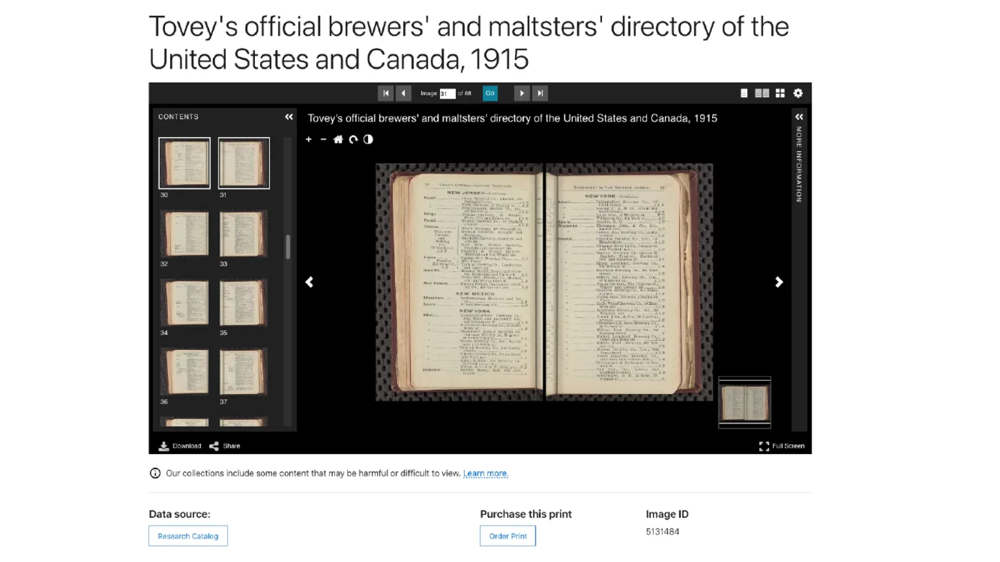

An enormous amount of work went into making this. Curators, photographers, metadata people, preservation folks, a million small decisions. So much work went into making this a digital object. And yet -- it is also an awkward way to work with what was once a really useful reference book.

Here is where I want to get to:

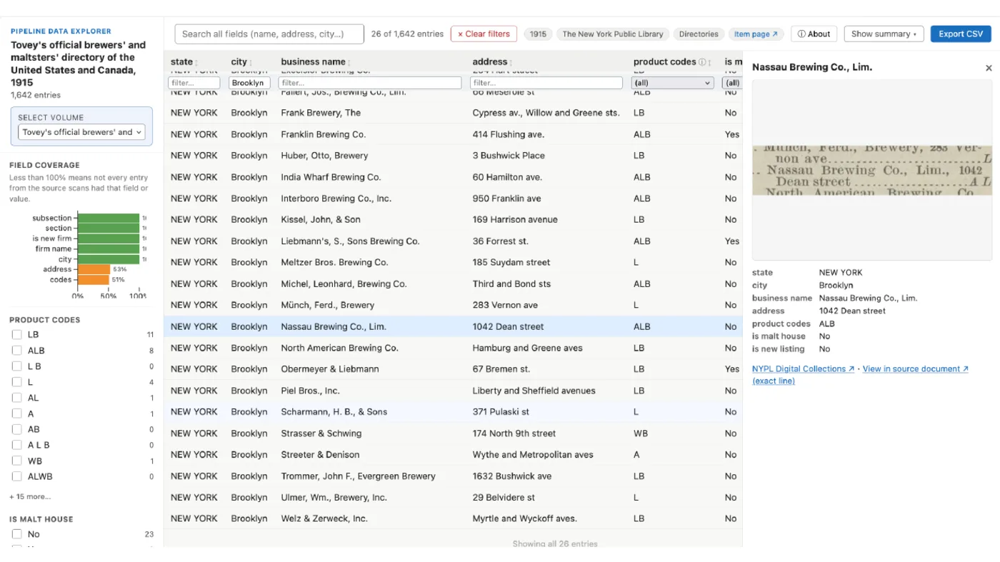

Same information, presented in a modern interface. Not just images of the information (though there are snippets), but something that is actually browsable. It's a wireframe-y prototype, deliberately unstyled, but it's a way of helping someone actually engage with the contents of that book — and, importantly, every row roots you back in the source. Click the Nassau Brewing Company (a Brooklyn building on Dean St. you can still see from the S train) and you get a picture of that entry as it appeared on the page, plus a link to its exact coordinates in the original scan.

I want to be very clear here that I'm not talking about some abstracted "data" representation of these works. The modern interface still incorporates the entries themselves and links to all the critical page context. This is not decorative -- in fact that connection to the underlying material and the structure and placement within the source is the reason I think librarians and archivists should be the ones doing this work.

## Two things I think are new here

The tool that makes this is the [Directory Pipeline](https://github.com/hadro/directory-pipeline/), which I've been building for about six months. You hand it a link to a digital collections item — anything with a [IIIF manifest](https://iiif.io/get-started/how-iiif-works/) — and it walks you through a human-in-the-loop, LLM-augmented set of steps that ends in structured data and a browsable explorer.

Two parts of that I think are genuinely new in the digital library context.

**Meta-prompting for item-specific extraction.** I didn't invent meta-prompting, but I haven't seen it applied much in our sector. You can ask Gemini or Claude to transcribe a JPEG, and it will do a decent job. You can even spend a bunch of time and iterations trying to eke out all the important details of structure, heading styles, column layouts, etc.

But *you* are never going to write as good a prompt for that specific volume as the model can write for itself, after looking at a handful of representative pages. It's ok! People are bad at this; we focus on the wrong things. So the human job in my pipeline is to pick five or ten good sample pages — the key, the abbreviations table, the average page, the weird layouts, the ones with advertisements in the middle of the entries — and the model's job is to design its own OCR prompt and its own data extraction schema from those samples.

**Two-pass consensus OCR.** The newer LLM-based tools produce near-flawless text but can't give you reliable bounding boxes. The older tools (Tesseract, Surya) give you bounding boxes but higher error rates on the text. So the pipeline runs both and aligns them: old tech for coordinates, LLMs for characters.

OCR passes are getting cheap enough that this belt-and-suspenders approach is excellent for another reason: it's a guard against hallucination. For a hallucinated line to survive this pipeline, two independent systems would have to hallucinate the same thing in the same place.

## The big picture problems

These are ideas that have been rattling around in my brain for nearly 20 years at this point, since I started Library School. In and of themselves, they have nothing to do with LLMs, except in that I think we're getting to a point where commodity rather than specialist tools can help us start addressing the issues, similarly to how we started including OCR text for digitized materials a few decades ago.

### 1. Looking at pictures of books is not the same as reading a book

JPGs embedded in HTML are better than nothing — but only a little bit better. Twenty-plus years of page-turners and PDF readers later, it still takes a lot of activation energy to spend real time with the books that we've spent a generation or more digitizing.

An example, and this time I'll pick an example from my own employer:

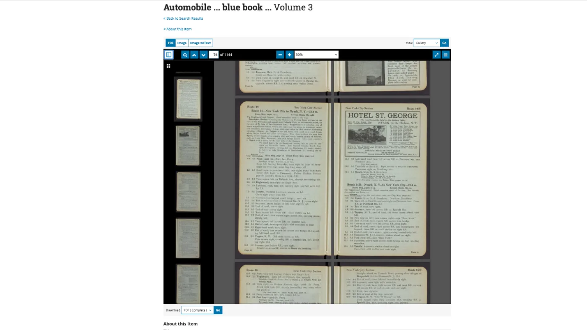

This is the 1915 *Automobile Blue Book*, Volume 3. It is a 1,200-page book of turn-by-turn driving directions from before highways were numbered, before there was a national highway system, before there were even state highway systems. If you were rich enough to own a car, you were probably rich enough to buy the book that told you how to get from New York City to Nyack. Elder millennials joke about how we remember printing out MapQuest directions to get anywhere; well, 1915 has us all beat.

It's an amazing resource, and it is very hard to spend more than a few minutes with it in this kind of digital object viewer.

I've been talking to my wife about digital library stuff I've worked on for years and years and years, and she recently distilled this better than I have ever managed to do: "Oh, when you say you 'digitized' a book, you mean you just took pictures of it?"

### 2. It's possible we in libraries have digitized *too much*

A related but different issue:

We've spent more than a generation digitizing millions of items. We have not spent nearly as much energy making them useful to the people who might appreciate them. That's not a criticism of the work that's been done — the metadata effort that made these things findable at all was Herculean, and those consistent standards are about to pay real dividends as new tools come along. But the ratio is off, and it has been for a long time -- we haven't put commensurate effort into making those things as useful as they could be. Figuring out ways to give people the handholds they actually want, the access mechanisms they want to spend time with. We've done an amazing job of digitizing and putting stuff online, and I think we're ready for some of the next steps.

## The thesis

The short version: the tradeoffs have shifted. Getting structured data out of digitized volumes used to be impossible. Then it was possible, but you needed an R&D lab. Then, with the Stanford NLP-era toolkits, it was doable and relatively cheap but only useful in fairly narrow circumstances.

I think we're now on the cusp of doable, cheap, *and* broadly useful.

The baseline I'm measuring against isn't "is this perfect." OCR has never been perfect. If you've ever tried to copy text out of a historical PDF — god forbid across a line break — you know exactly how imperfect. We decided decades ago that OCR was worth doing anyway, because searchable-with-flaws beats not-searchable. I think we're arriving at the same answer for this next layer of enrichment.

## The catalysts

A few things pushed me from thinking to building:

- Flipping through a Green Book reproduction with my kid, looking up entries near where we live in Brooklyn, and using them to talk about how substantially Brooklyn and the country have changed — and then thinking about all the other things I couldn't do that with, because they're locked in page images.
- Paul Ford's op-ed, [The A.I. Disruption We've Been Waiting for Has Arrived](https://www.nytimes.com/2026/02/18/opinion/ai-software.html?unlocked_article_code=1.0VA.Pf2C.Y5I6TrcOzxkR&smid=url-share), which more or less said: the tools are good now, they unlock things. That's what made me think *I could also start building this. I should.*
- Mark Humphries on [Gemini 3 Solves Handwriting Recognition](https://generativehistory.substack.com/p/gemini-3-solves-handwriting-recognition) — not that it's flawless, but that it's now at or past the 1–3% error rate of human transcribers.
- [Multimodal LLMs for OCR, OCR Post-Correction, and Named Entity Recognition in Historical Documents](https://arxiv.org/abs/2504.00414), from which I stole several techniques outright.

### Vonnegut's barber

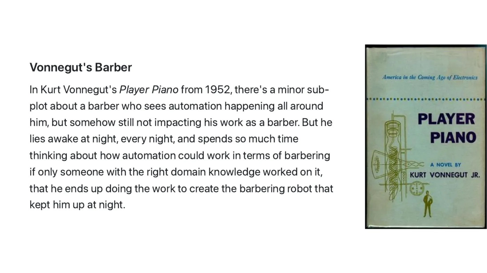

In Kurt Vonnegut's *Player Piano* (1952) there's a very minor character, a barber, who watches automation arrive in every industry but his own. He lies awake every night thinking up reasons a robot could never cut hair — until he works out that it absolutely could. He teaches himself some engineering, and in a very Vonnegut turn, he becomes the man who invents the haircutting robot that was keeping him up at night.

I don't think I'm the barber in that metaphor. But it is a metaphor I think about a lot.

### Navigating the Green Book

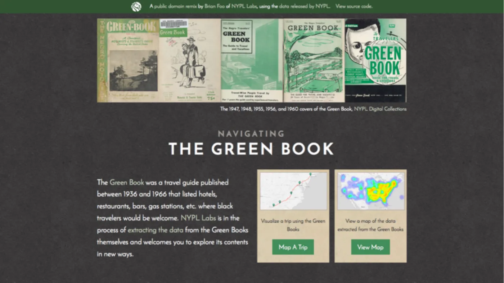

This is the project I've wanted to finish for a decade, and that made me want to build the pipeline -- and, importantly, it is not my project!

Back in 2014, when I oversaw the digital imaging unit and the metadata services units at NYPL, Maira Liriano at the Schomburg Center proposed digitizing NYPL's nearly complete run of the Green Books. We did it, and put them online in the public domain. That's the system working! The Green Books were already well known in many circles, and were already well researched in various Black scholarship domains, but making almost the entire run of the Green Books was still an important means of giving many more people a point of entry.

About a year later Brian Foo, then at NYPL Labs, built [Navigating the Green Book](https://beefoo.github.io/greenbook-map/) as a way of demonstrating the kinds of things that could be done with NYPL's Public Domain release. The interface he built on top of the Green Books is essentially Google Maps, but routed only through Green Book listings -- so you try to create a route between two places, but the only options you have are locations listed in the Green Books, i.e. known safe places for Black travelers to eat or stay at. It puts a modern interface on top of these very specific artifacts of Jim Crow America, and making it easier to engage with the listings they contained.

My small role was helping with data extraction, and in 2015 it was *brutal*. We wanted all 23 volumes; we managed one, plus one that the University of South Carolina had hand-transcribed. Everything else was too much manual work.

What I showed at Aboard is, in a real sense, the finished version of the part of that project we couldn't finish ten years ago.

(A side note I still love: because those volumes went online as public domain, a publisher in California, About Comics, has been selling Green Book reproductions ever since. Someone found something they cared about and made a business of it. That's a dream use of the public domain.)

## The pipeline itself

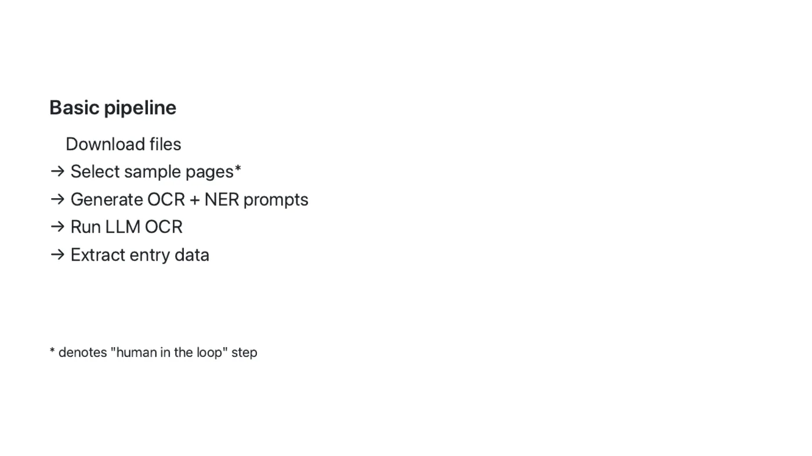

The basic version works with items from the Internet Archive, the Library of Congress, or basically anywhere that publishes IIIF (which includes CONTENTdm sites). It downloads the files; you pick your sample pages (the human step); the model writes its own OCR and NER prompts from those samples; then you run the OCR and the extraction.

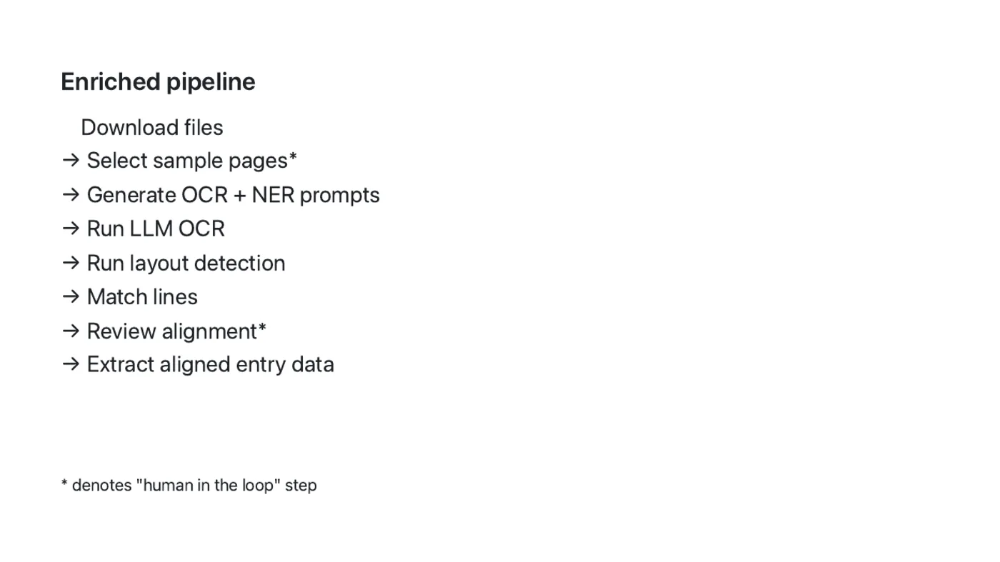

The enriched version adds the coordinate work: automated layout detection and line matching, a human alignment/review step, and then aligned entry extraction. That's what gives you a CSV where every row carries both the data and the exact spot on the page it came from — and it's where the hallucination guard comes in.

Two of the human-in-the-loop steps, since they're the ones people ask about:

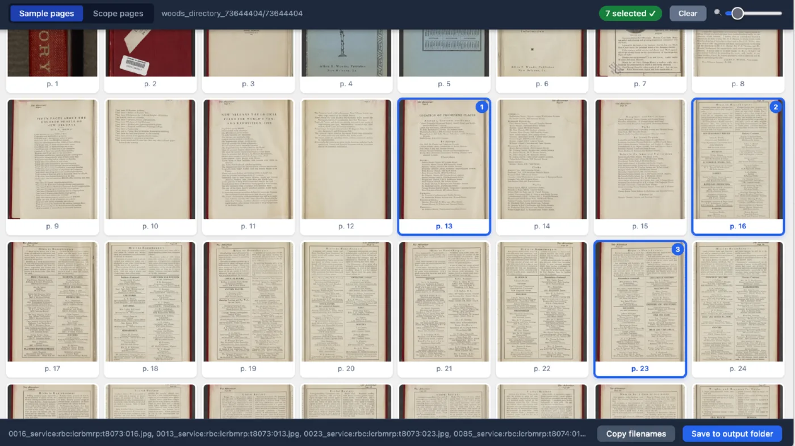

Then comes the fun stuff: the data explorer, geocoding and map interfaces where there's a geographic component, and cross-volume comparison. 

And now we're talking about possible infrastructure for making this kind of resource more broadly usable. I'm not showing the code, because it's really in the weeds, but the results of this are, in my opinion, an extremely engaging way of working with these kind of volumes, and with just a touch of design work they're a great way to connect people to these library materials.

And I've been talking about this in terms of single volumes, but those prompts — the OCR prompts and the NER prompts — can work at the collection level. If you have 35 volumes or 100 volumes running through the same pipeline, you only have to do that selection process once, and then you get all of these data extraction pieces. You can build cross-volume comparisons, that's the fun stuff.

## What comes out

The brewery guides above are an example of the raw output — this is what falls out of the Python scripts with no design work at all. [Explore them here](https://hadro.github.io/brewery-guides/explorer#about).

The one I spent actual design time on is the [Green Books and other travel guide explorer](https://hadro.github.io/green-books/all-volumes), which brings together the Green Book and the other Black travel guides that have been digitized — roughly 105,000 entries across 45 volumes, [now also on Hugging Face](/blog/green-books-hugging-face/) [Ed. Note: the NYPL Schomburg Center has since added more volumes even since this talk! Up to 50 volumes, and more than 113,000 entries covering 1930-1966]. To my knowledge it's the first time these titles have been brought together in a relatively complete way. There was also a satisfying side quest: NYPL's run was missing the 1946 edition, and a digitized copy at the Library of Congress rounds out the set. IIIF made much of this not just possible, but easy to design a tool that integrates an additional volume from a totally different institution without much hassle.

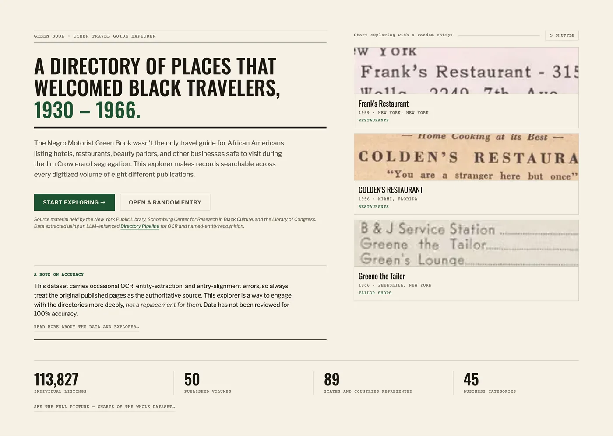

Every time you load that page it hands you three entries at random, as cropped images of the actual printed listings. There's always a little terror in putting a randomized shuffle on anything — but it's the fastest way I know to get someone to fall into the material.

A few things I demoed live that are worth calling out.

**Every one of those entries links to its exact location on the page.** Search for a name and click any row, and you get the entry itself, the fields extracted from it, and a picture of how it was printed.

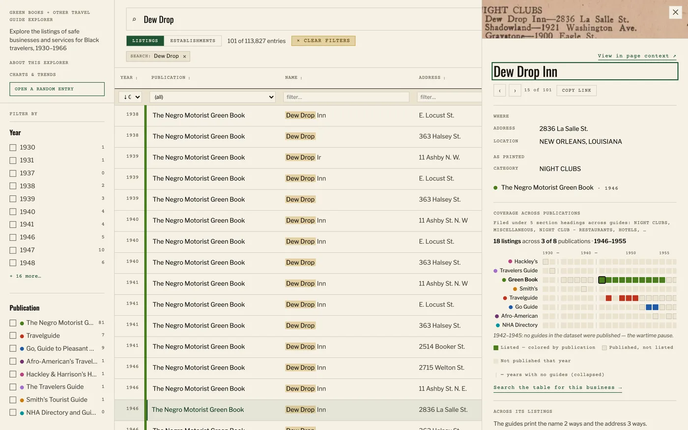

But the part I care about most is the link out of the data and back into the book:

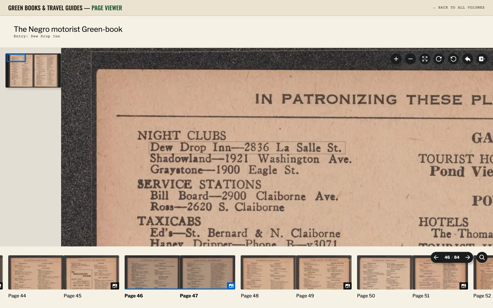

That's the actual page, with the entry outlined where it sits — in this case in the 1946 volume, the one held by the Library of Congress rather than NYPL. The entries have a lot of value; so does everything around them — the typography, the ad layouts, the visual language of the listings.

**Cross-volume views.** Search "Dew Drop" and you'll find many establishments by that name across the country. The establishments view collapses the name and address variations so you can see at a glance which places show up in the most volumes.

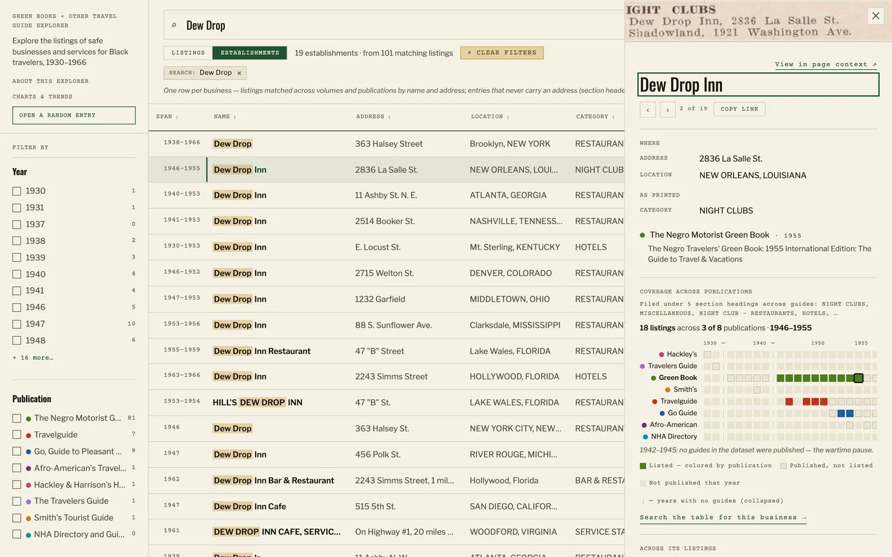

Nineteen establishments, from 101 matching listings. The famous one in New Orleans appears across the Green Book, Travelguide, and the Go Guide; the Dew Drop in Bed-Stuy ran from 1938 to 1966 but only ever appeared in the Green Book.

**A New York City map version.** I wouldn't geocode the whole country — historical geocoding is not something I trust without human review — but New York City addressing has been directionally stable since the 1940s, so for that subset I built a neighborhood-faceted map.

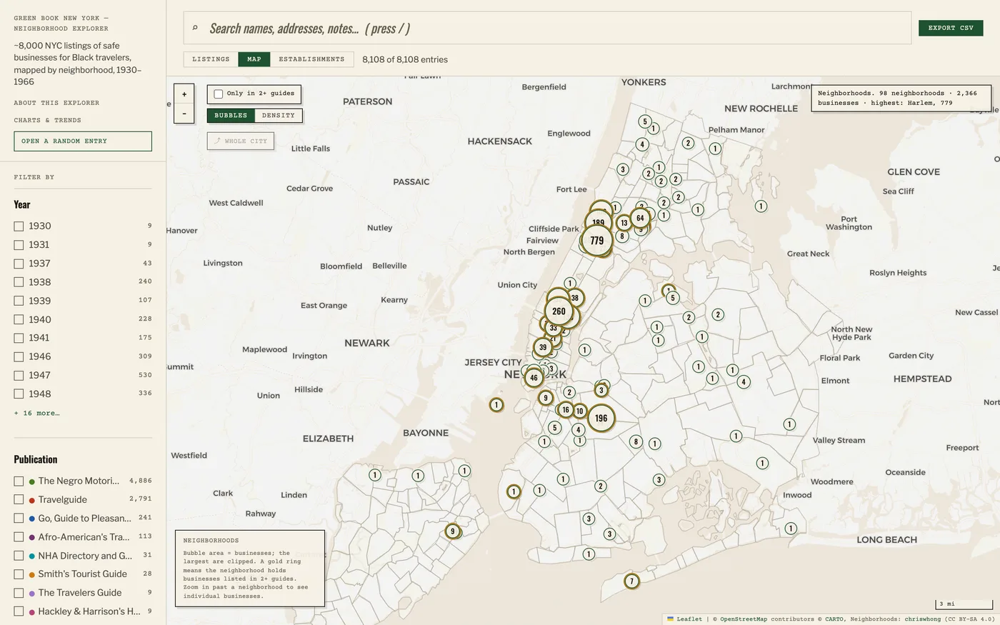

The whole Green Books explorer cost about $7 in API calls (plus, obviously, a bunch of my time). The brewery guides were about $3 or $4. And the costs here are primarily because I'm being lazy and using Gemini; there's no reason local models couldn't do all of this, especially six or twelve months from now.

### Next up: morticians

The teaser I ended on is the 1948 *National Directory of Morticians* — almost 600 pages of listings, with just some incredible fonts and boxes.

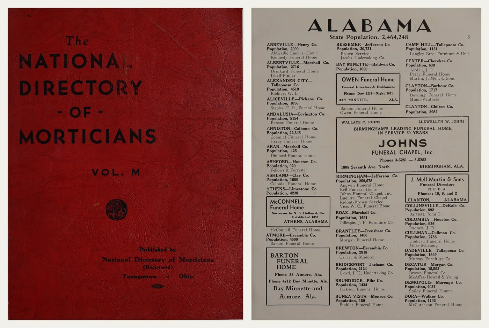

Two things about it:

Ten years ago, the ad that runs across two columns on that page would have blown up any data extraction tool you tried to write. Now it's very straightforward for a vision language model.

And: every listing includes the population of the county the mortician operated in. Which is such a *Six Feet Under* detail. It's actuarial. That's what mattered to the people using this book — a county of 10,000 people with only one mortician probably needs another one.

In conclusion:

I think you should all go find an item. The source code for the Directory Pipeline is open. Let's have a world where everybody's got a data viewer for their own weird special interests -- what a beautiful world that would be!

*My thanks to Paul Ford and Molly McArdle and everyone at Aboard for hosting, and to everyone who came out and expressed interest and asked questions.*
