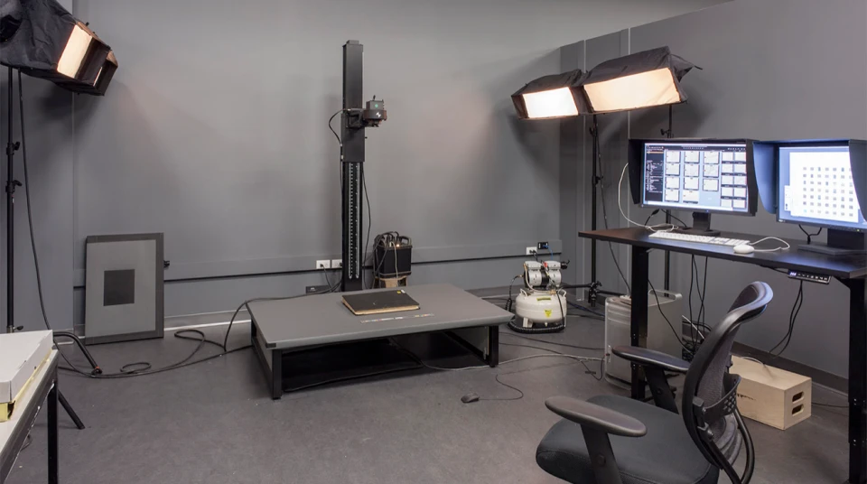
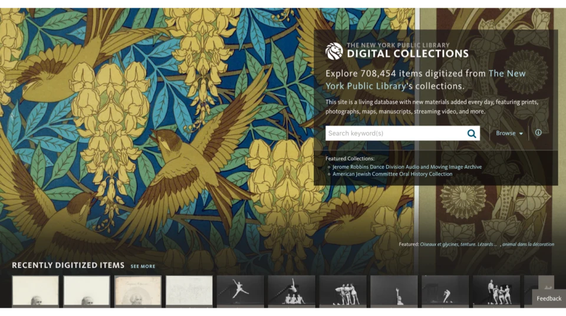
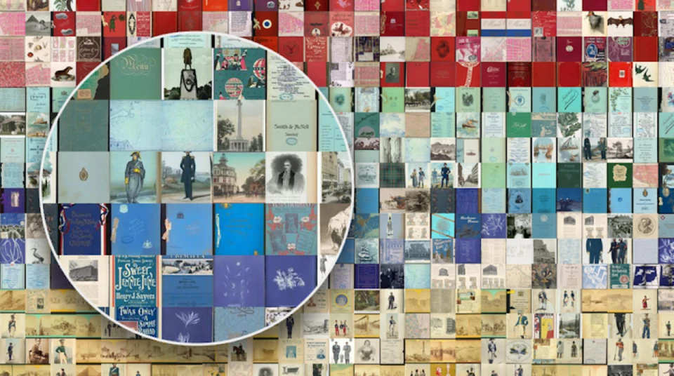
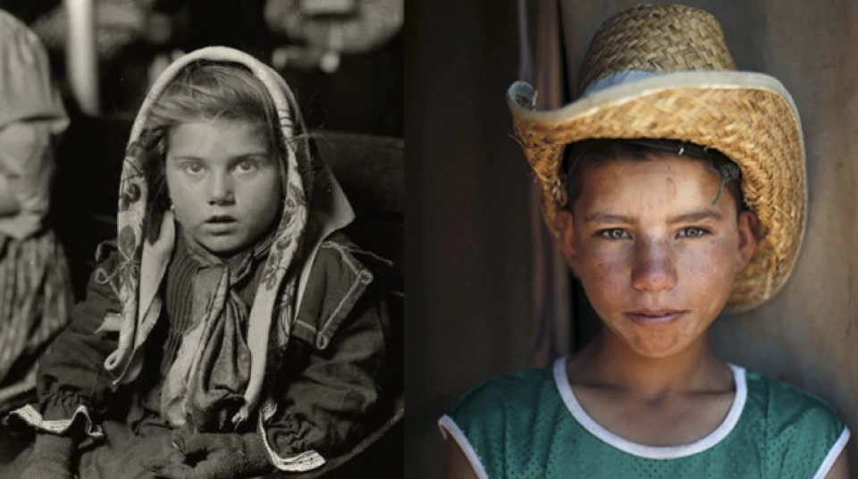
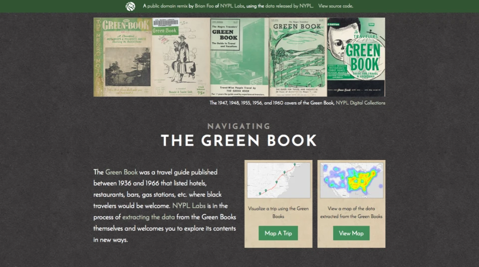
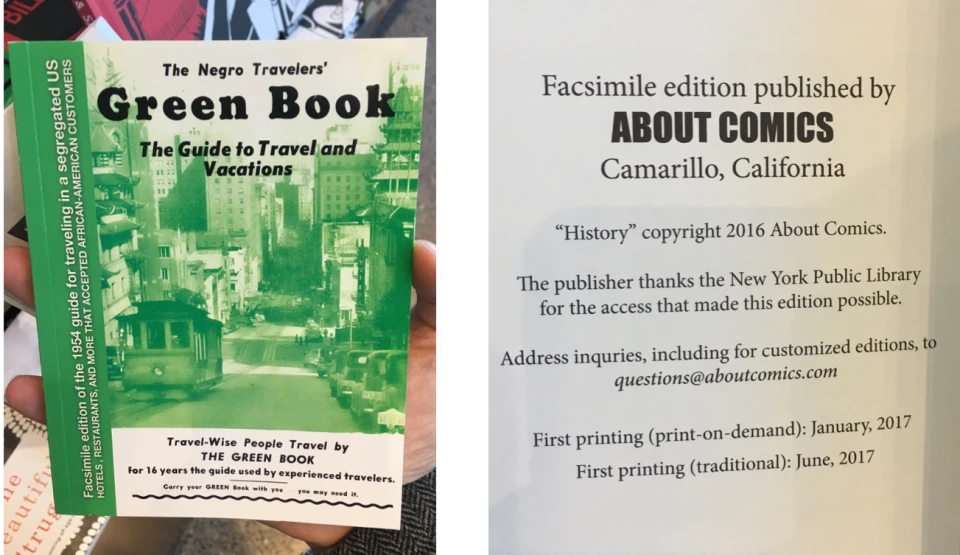
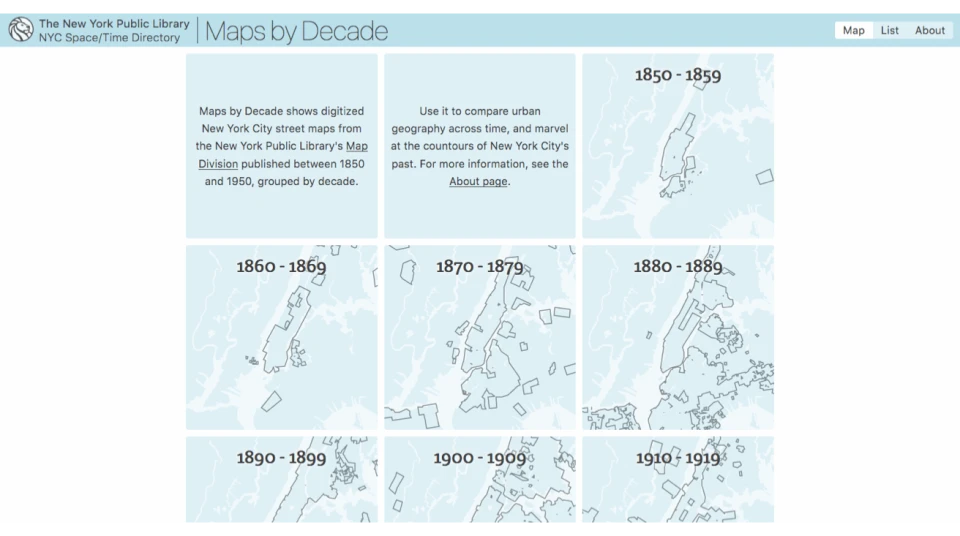
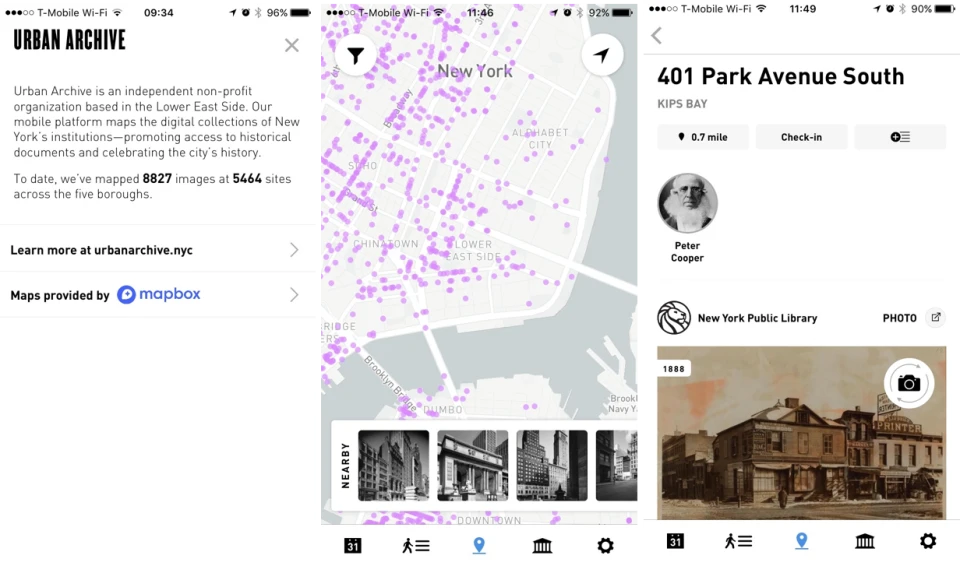

*Originally published at [https://www.nypl.org/blog/2017/11/06/manufacturing-impact-digitize](https://www.nypl.org/blog/2017/11/06/manufacturing-impact-digitize); the contents here were originally presented at the [2017 Smithsonian Digitization Fair](https://dpo.si.edu/2017-smithsonian-digitization-fair-welcome-0) on a panel titled "Manufacturing for Impact" (rescheduled or "rebooted" from March 14, due to a massive blizzard that cancelled the conference the first time around). Below is (roughly) what I covered, and some links to the sites and projects I mentioned.*

---

This work is licensed under a [Creative Commons Attribution 4.0 International License](http://creativecommons.org/licenses/by/4.0/).

*NYPL digitization copy stand*

### Access → Impact

Why do we digitize? My initial instinct is to say something like "to further our mission of access to cultural heritage materials," or "to give people around the world access to things that otherwise would require people to travel to New York City." This is right, I think, but not sufficient: why is access important?

Access is important because we want people to use our collections to enrich their lives and the lives of others. I believe that's the reason we collect and process the materials in the first place, steward them over centuries and decades, and then do things like digitize them.

Put another way, particularly in the parlance of the conference theme: access is just a waypoint toward impact.

*NYPL [Digital Collections](http://digitalcollections.nypl.org/) site*

### Access, analytics, and signal loss

Institutions like NYPL have been digitizing for decades (and we were reformatting to things like microfilm for decades before that...). That's tremendous, because it means that there are now millions of items that are now more findable than ever before — just take a look at sites like [Europeana](http://europeana.eu/) and the [Digital Public Library of America](http://dp.la/) to see the evidence of the robust body of digitized cultural heritage works.

But I think there might also be an interesting signal loss now that we've been digitizing for more than a generation. If other institutions are anything like mine, we're killer at counting digitization throughput, and measuring analytics around the performance of the materials we put online in our [Digital Collections platform](http://digitalcollections.nypl.org/), or the [HathiTrust Digital Library](http://hathitrust.org/), or DPLA, etc. But those are just shadows on the wall compared to what we're really after, which is meaningful engagement with and use of the materials.

Try the following absurd thought experiments — I think these situations would be a bummer, but see what you think: imagine all of our digital collections offerings across the industry were all available via one infinitely scrolling page. People could spend countless hours scrolling through the images we've made available! People — millions of people — would totally do this. This would be a marvel of access, and would make almost no impact on anyone's life. Intuitively, this feels like it would be better than digitizing things that never get seen or clicked on, but ... not by much.

Now imagine a similar thought experiment, ratcheted down one notch of absurdity: imagine if Facebook decided to do a massive pro bono partnership with libraries and museums, and suddenly decreed that 5% of all newsfeeds would be digitized items from the cultural heritage sector (say, via DPLA's metadata aggregation...). Tens of millions of people would see millions of images that might otherwise never get as many views. But this would still essentially be a bummer, in my opinion (though I'm sure the analytics bumps would make a lot of administrators very happy in the short-term): there would be hundreds of millions of eyeballs engaged, but nary a heart string tugged nor a neuron fired.

Why are these (admittedly absurd) situations a bummer? Because they do almost nothing to further our mission. If showing people these images then leads them to reuse the material in a creative work of some kind, that's what we're after. If showing people these images leads them to reflect on their personal circumstances, broadens their perspectives and influences how they engage with the world and others in it, then that's what we're after. But no matter how I slice it, it seems to me that the basic principle of flashing images in front of people's eyeballs isn't doing much to advance our missions, let alone make good on the investments we've made in digitizing our collections.

*Visualization tool for the NYPL Public Domain Release*

### Beyond analytics: impact approaches

Now, that all said, there's a great reason for the primacy of analytics and aggregate metrics: it's really hard to measure use and impact! It's much easier to highlight aggregate analytics on views, which imply *potential impact* rather than measuring it directly.

During the run up to NYPL's [Public Domain Release in 2016](http://publicdomain.nypl.org/), my former colleague [Shana Kimball](https://twitter.com/shanakimball) and I spent a lot of time talking about how to encourage "use and reuse" of our materials, and solicited feedback in a number of ways, including the hashtag [#NYPLremix](https://twitter.com/search?vertical=default&q=%23nyplremix&src=typd), among other efforts.

The following are three ways I've come to think about our approach to "manufacturing" impact, based on that work with Shana and delving into our analytics in the last few years. The first two of these approaches were specific tactics deployed as part of the Public Domain Release, while the last is a broader, long-term approach that in some ways builds on the others.

*[From a photo essay](http://www.pri.org/stories/2016-01-18/two-groups-one-dream-these-photos-compare-immigrants-landing-ellis-island-todays) juxtaposing early 20th c. immigration through Ellis Island with the Syrian refugee crisis*

### The "honeypot" approach

Perhaps the simplest strategy we employed was what I like to call the "honeypot approach." Basically, this is the notion of putting out the [raw assets](http://api.repo.nypl.org/#pd-filter) and [metadata and scripts](https://github.com/NYPL-publicdomain/data-and-utilities) in thoughtful and easy-to-use packaging and UX, to make it simple and appealing for people anywhere in the world to make use of our collections materials. It can also come in the form of simply packaging or repackaging existing assets in a way that is "irresistible," directing people to the curated sets of materials that are most likely to pique their interest. Even simple "recently digitized" sets might fall into this category, though I think there needs to be something to make the materials more appealing and easy to work with than just a raw listing approach.

For example, Shana worked with staffers across the institution to create a series of blog posts called "[Spotlight on the Public Domain](https://www.nypl.org/voices/blogs/blog-channels/nypl-labs/public-domain)," which targeted a wide variety of audiences.

Here are a few instances of people making use of the materials we highlighted:

- A [moving photo essay](https://www.pri.org/stories/2016-01-18/two-groups-one-dream-these-photos-compare-immigrants-landing-ellis-island-todays), juxtaposing "Photos of immigrants on Ellis Island and today's Syrian refugees"
- A look at "[What Beyoncé's 'Formation' might look like if it were set in the 1930s](http://www.upworthy.com/what-beyoncs-formation-might-look-like-if-it-were-set-in-the-1930s)," using Farm Security Administration photographs
- An [original historic New York City coloring book, based on the photos of Berenice Abbott](https://jsgraboyes.com/coloring-books/)
- An [art skateboard design company](https://headyscholars.tumblr.com/tagged/nyplremix) that creates original prints for skateboard decks
- Ongoing works, tagged on various platforms using the hashtag #NYPLremix (e.g., [Twitter](https://twitter.com/hashtag/nyplremix?f=tweets&vertical=default), [Instagram](https://www.instagram.com/explore/tags/nyplremix/))

### Example project approach

In a sense, one of the problem statements we started with for the Public Domain release was, "how do we encourage people to make meaningful use and reuse of the materials we are making freely available?"

One answer is, "show them what kind of things can be done." The tactic here was releasing example projects based on our collections that would hopefully serve as examples of things others might do. These three "Public Domain Remixes" ("[Street View, Then & Now: New York City's Fifth Avenue](http://publicdomain.nypl.org/fifth-avenue/)", "[Mansion Maniac](http://publicdomain.nypl.org/mansion-maniac/)", and "[Navigating *The Green Book*](http://publicdomain.nypl.org/greenbook-map/)") created by some of the developers on the team ended up being the stars of the show, challenging our audience to carry on with the effort and create even more creative and important works, all done with the basic raw assets we were making available.

Though all three projects served this purpose well, I'll focus here on the one that seems to have the broadest and deepest appeal.

*[Navigating the Green Books](http://publicdomain.nypl.org/greenbook-map/) public domain remix*

#### Navigating *The Green Book*

The project, titled "[Navigating *The Green Book*](http://publicdomain.nypl.org/greenbook-map/)," took as its source a series of publications known as *The Green Book*, which "was a travel guide published between 1936 and 1966 that listed hotels, restaurants, bars, gas stations, etc. where black travelers would be welcome."

(Read more in [the Green Books blog post](https://www.nypl.org/blog/2015/03/24/schomburg-treasures-green-book) from when we first digitized the materials.)

The tool, developed by my former colleague Brian Foo, takes the [OCRed addresses from the listings](https://github.com/NYPL-publicdomain/greenbooks) and displays them on a familiar maps interface. It also lets users plot routes from one address to another, or one city to another, and in doing so, you can see the complex and sometimes circuitous routes that would have been required of Black travelers in the 1940s and 1950s to find food or lodging at one of the listings in the guides. On the landing page of the project, Brian wrote: "We encourage you to explore these books; map them in your mind. Think about the trips you could take, can take, will take. See how the size of the world can change depending on the color of your skin."

NYPL [digitized the volumes](https://digitalcollections.nypl.org/collections/the-green-book#/?tab=about&scroll=0) in 2014 at the suggestion of Maira Liriano, the Associate Chief Librarian of the Jean Blackwell Hutson Research and Reference Division at the Schomburg Center for Research in Black Culture. And while the materials saw a lot of visits from the day they were published online, it was clear that this important set of volumes could be showcased in an even more powerful way. Brian took notice of the materials, and applied a critical lens similar to that which he's used to pursue a [number of personal software art projects](http://brianfoo.com/).

*Facsimile reproduction a Green Book volume, using images made available via the Public Domain Release*

Meanwhile, since the Navigating *The Green Book* tools was published, we've heard from many educators who have used the materials as part of curricula that touch on Jim Crow-era America and related topics, as well as from Digital Humanities instructors in college and graduate programs who hold it up as an example of an impactful use of historical text. Beyond that, this familiar 21st century interface to mid-20th century discrimination has prompted numerous mentions in blogs and news articles because it provided these materials a modern digital hook that the digitized pages otherwise can't really provide on their own as images embedded on web pages.

It's even prompted a small California press called "About Comics" to reprint one of the issues as a facsimile edition, based on the images released from NYPL's digitization efforts.

### Platform approach: The NYC Space/Time Directory

The final project I'll touch on is The NYC Space/Time Directory. The approach here is a bit broader, but also largely focused on setting up the circumstances to encourage greater use of our collections materials.

I should acknowledge upfront that this is a more resource intensive approach to making our collections more useful and more meaningful, and has been generously funded for the last two years by the Knight Foundation.

Here's how we describe the [NYC Space/Time Directory on the project's homepage](http://spacetime.nypl.org/):

> The NYC Space/Time Directory will make urban history accessible through a set of resources including: a searchable atlas of New York past, an historical location directory and geocoder, a set of APIs and data sets, and a discovery tool linking NYPL collections together in an historical and geographic context.
>
> These explorations will provide a way for scholars, students, enthusiasts, and librarians to explore New York City across time periods and to add their own knowledge and expertise.

The platform described here essentially builds on the process NYPL has been undertaking for years in an attempt to "unlock" the data latent in images of maps, city directories, telephone books, genealogical records, mortgage records, and much more. Previous tools include the [Map Warper](http://maps.nypl.org/warper/), which allows users to geo-rectify atlas pages to align precisely with mapping interfaces, and [Building Inspector](http://buildinginspector.nypl.org/), which applies computer vision to insurance atlases and then supplies identified sections of images to a crowd-sourcing interface so users can help the Library verify and correct building footprints through the decades.

All of this [data and more](http://spacetime.nypl.org/#data), along with links to the original digital assets, enter into the Space/Time platform through an "extract, transform, and load" process, and will be made available through a constellation of tools and interfaces to help people integrate what we know about the urban landscape of New York City with their own data sets, tools, and historical/genealogical research efforts.

And it gets better: once we get a set of base layers of urban geography for each year, with all the evolving street names and address schemes, we'll be able to accurately pinpoint things like photos of buildings not just to particular street address, but also to a particular point in time. Or as we like to think of it: Google Maps with a time slider.

*The [Maps by Decade](http://spacetime.nypl.org/maps-by-decade/) home page*

One example tool that's already proven useful to casual researchers and dedicated genealogists is a historic map interface titled "[Maps by Decade](http://spacetime.nypl.org/maps-by-decade/)." It's "a new way to view more than 5,000 digitized street maps of New York City from our collection, published between 1850 and 1950... With Maps by Decade, finding and viewing georectified maps is easier than ever. Use Maps by Decade to browse and compare the streets of New York City, one decade at a time. See how your neighborhood looked in a hundred years ago, and download maps in high resolution, most of which are available in the public domain." You can see more in the [blog post by Spacetime Engineer Bert Spaan](https://www.nypl.org/blog/2017/04/07/nyc-spacetime-directory).

Another tool is called "[Surveyor](http://spacetime.nypl.org/surveyor)," a tool to "to make it easier to find NYPL's digitized photos by the location where they were taken." Surveyor invites users to "try and determine the locations depicted in these mostly unlabelled photos ... [to] create a database containing the geographic locations of our photos, [where] this data will be available for everyone to use and download." (Read more from [Bert's announcement of the Surveyor tool](https://www.nypl.org/blog/2017/07/07/surveyor-photos-map).)

Beyond helping users make easy use of digitized maps and collections, since this project is still in flight, it's a bit premature for us to say precisely what impact it will have. But based on what we've seen with other platforms and example projects we've put out in the wild, the first adopters are likely to be the geodata wonks eager to get ahold of any and all historically accurate data in order to fill in gaps in their own data sets, and draw important connections to tools they've already created. Likewise, commercial and non-commercial genealogical organizations like ancestry.com and others are keen to see what materials we make freely available, that might be incorporated into their offerings.

*Screenshots from the [Urban Archive](http://urbanarchive.nyc/) app*

One example is the non-profit software development outfit [Urban Archive](http://urbanarchive.nyc/) (disclosure: Bert Spaan and I have advised on the development of their app, and it felt good to know how easy they found working with the [open data sets](http://spacetime.nypl.org/#data) we've already released via the Space/Time Directory website, but we were not compensated in any way other than good feelings). According to their site,

> Urban Archive is a location-based mobile app that empowers New Yorkers to learn about history where it happened.
>
> The app brings together the digital collections of New York City's museums, archives, and libraries in an easy-to-use resource built for discovery.

Though it's still in beta, it's useful for folks who want to see nearby historical points of interest, particularly photographs of buildings pinpointed on a mobile map interface. The thing I love about it is that it incorporates our data and connections to our digitized collections, and synthesizes those with similar offerings from many other institutions. What's more, they do it in a way that's really compelling and engaging, via a mobile app that we could never have developed ourselves, but that's still useful and openly available to our patrons and researchers.

### Sewing it all together

Perhaps the novelty of digitized collections has worn off a bit, especially as we enter an era of "[mass digitization](https://www.washingtonpost.com/news/speaking-of-science/wp/2017/02/08/this-is-how-you-photograph-a-million-dead-plants-without-losing-your-mind/?utm_term=.797141baefc7)." Without delving too deeply into the economics of it all, the supply of high quality digital surrogates of incredible cultural heritage primary sources is increasing at an incredible rate. There's a lot more work to be done to flesh out more complete impact models and tie our digitization priorities to measurable outcomes, but in the meantime I hope the description of these three more proactive approaches to manufacturing impact spark some ideas and prove useful at other institutions.

*Final note: I'm very grateful to the Smithsonian [Digitization Program Office](https://dpo.si.edu/) folks for putting on a great event that prompted some reflection. For more about the Smithsonian Digitization Fair, see the [#SIdigi hashtag](https://twitter.com/hashtag/sidigi?src=hash).*
