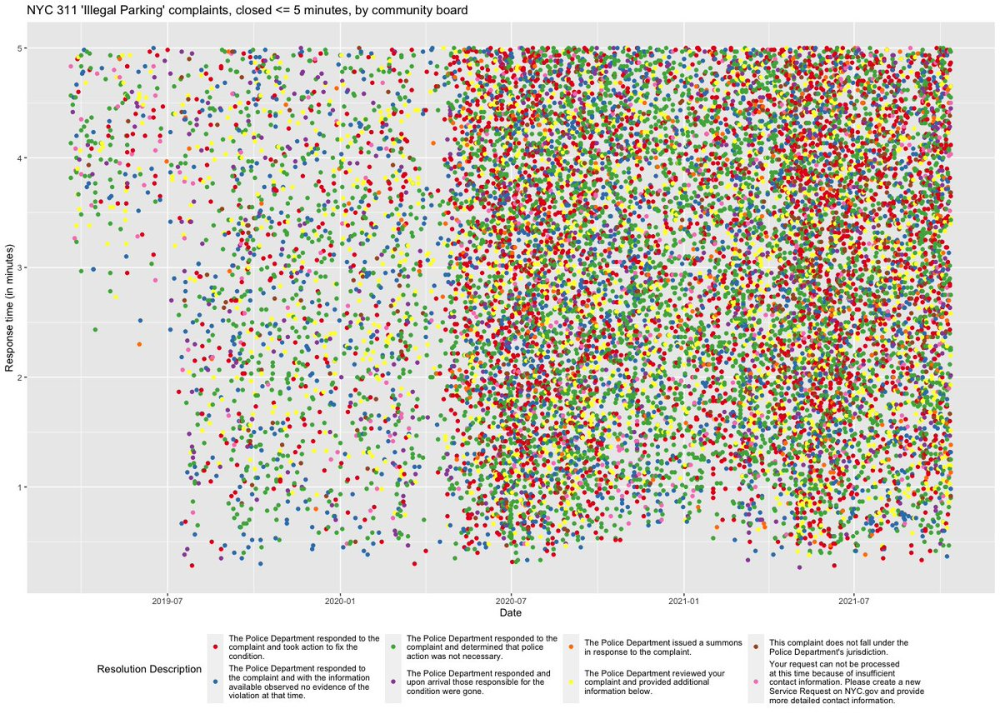
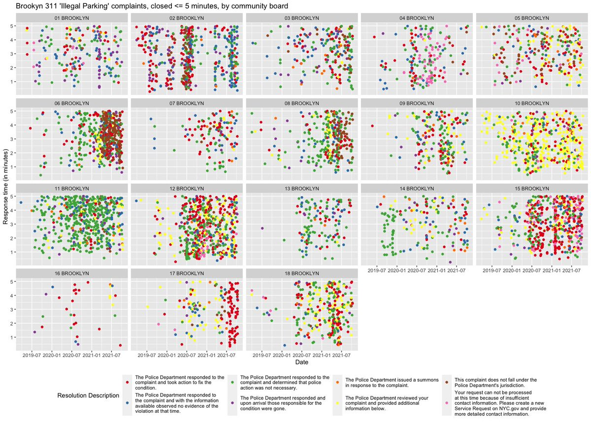
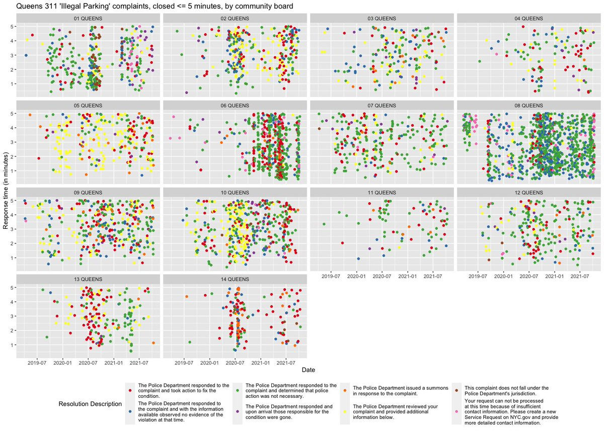
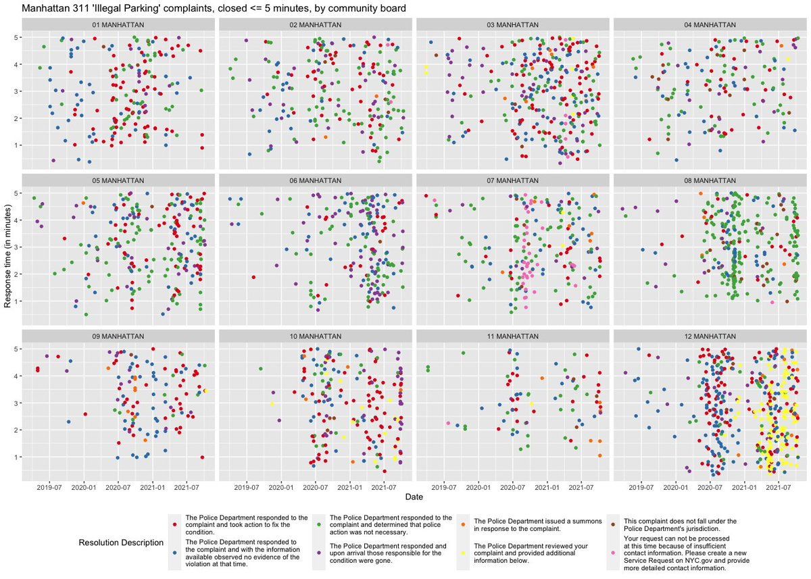
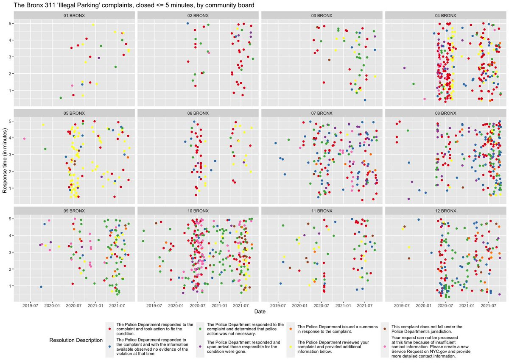

*[This post was assembled from a Twitter thread in October 2021.]*

---

I was curious about the claims made here re: NYPD closing out complaints in less than 5 minutes [Note: the original tweet I was quoting seems to be gone, but that quote tweet was itself referencing this [tweet from then NYC Council Speaker Corey Johnson](https://web.archive.org/web/20211013153557/https://twitter.com/NYCSpeakerCoJo/status/1448304238355009545), accusing NYPD of falsifying responses to parking complaints], and since NYC makes @NYC311 data openly available, I thought I would take a look. The number of 311 complaints closed in less than 5 minutes has increased a lot since the pandemic!

But it's more than just closing tickets in < 5min -- if you look by community board, you see a lot of clustering of resolution descriptions that sure looks a bit funny. For example, CB6 in Brooklyn has seen a lot of "not our jurisdiction" closures ramp up in the last few months.

Here are the other 3 boroughs, which all exhibit this to some degree when you look at complaints closed out in under 5 minutes. [Ed note: When I published this to Twitter, I definitely had Staten Island in there, but the Twitter archive didn't seem to capture that last tweet]

