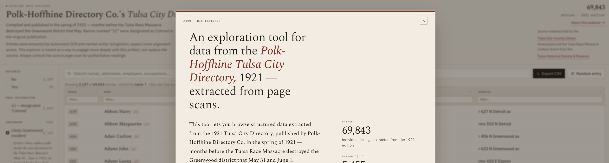

Here is a story about how being annoyed for 5 years by a wonderful and moving [New York Times data journalism piece](https://www.nytimes.com/interactive/2021/05/24/us/tulsa-race-massacre.html?unlocked_article_code=1.lFA.e3VE.V5pm6dDzVBzf&smid=url-share) resulted in the creation of [a data explorer for the 1921 Tulsa City Directory](https://hadro.github.io/tulsa-city-directories/1921#about).

If you don’t care about the backstory and just want a useful public domain resource, here is the data explorer for the Polk-Hoffhine Directory Co.'s Tulsa City Directory 1921, published just weeks before the Tulsa Race Massacre in late May/early June 1921:
-  **<https://hadro.github.io/tulsa-city-directories/1921#about>**

And here are the underlying CSVs for the 1921 and 1922 City Directories, after parsing through them with a LLM-assisted optical character recognition (OCR) and named entity recognition (NER) pipelines:

- [1921.csv](https://raw.githubusercontent.com/hadro/tulsa-city-directories/refs/heads/main/1921.csv)
- [1922.csv](https://raw.githubusercontent.com/hadro/tulsa-city-directories/refs/heads/main/1922.csv)

Any possible copyrights have expired, so the underlying city directories are in the public domain, so therefore all of this data is in the public domain with no possible copyright restrictions.

/While there are almost certainly OCR errors and potentially  data extraction errors, I still believe this is a useful dataset for anyone looking into the time period, or anyone interested in engaging with documentary evidence of a vibrant Black social and business community that was all but extinguished in the 1921 Tulsa Race Massacre. It is the output of a tool I’ve been building called the “[Directory Pipeline](https://github.com/hadro/directory-pipeline/).”

I've compared this to the [dataset released by the New York Times](https://github.com/nytimes/tulsa-1921-data) (see below for the backstory), and all of the entries they identified are also identified by the output of the pipeline tools. While it's a little tricky to fully replicate their work because the methodology section often offers only broad strokes, I feel confident that this is as accurate a representation of the underlying city directory data as is represented in their piece (there are even some names and addresses that I have found that were likely Greenwood residents that don't appear in their data, but again because they don't specify their exact methods it's hard to be 100% sure).

--- 

## On being annoyed

This all came about because I got annoyed in 2021 about an amazing New York Times piece, almost exactly five years ago today.

To mark the 100th anniversary of the Tulsa Race Massacre in 2021, a team of data journalists at the New York Times published a wonderful and moving article titled "[What the Tulsa Race Massacre Destroyed](https://www.nytimes.com/interactive/2021/05/24/us/tulsa-race-massacre.html?unlocked_article_code=1.lFA.e3VE.V5pm6dDzVBzf&smid=url-share)." The article uses photographs, Sanborn Maps, a 1921 Tulsa City Directory, and other archival sources to present a striking recreation of the Greenwood neighborhood, which they describe as "a thriving community of commerce and family life to its roughly 10,000 residents."

It's an amazing piece of data journalism, and the best kind of marriage of journalism and archival research that uses cutting edge technologies to shed light on important historical legacies, and uses new tools to connect viewers to stories and histories that need more people to engage with them.

It's a tremendous feature -- and it made me really frustrated.

Obviously, not the content! What frustrated me was the fact that such a powerful piece of journalism, with such clear ambitions to educate the public and repair the public record, could leave such gaps when it comes to describing the public domain data manipulations and processes they used to inform their piece. 

When the piece was published in 2021, I wrote this on Twitter (You can see a compilation of my contemporaneous thoughts here in [this archive post](https://hadro.github.io/blog/tulsa-race-massacre-data-journalism-and-why-libraries-digitize/)):

> The folks who built this article did amazing things with public domain Sanborn maps from the @LibraryCongress and elsewhere, and used machine learning tools (that we were only dreaming of in @nypl_labs 5 years ago) to build the 3D models of historical Greenwood.

> And then they used public domain city directories to extract amazing detail about the historical addresses in the Greenwood neighborhood, thanks to the digitized materials made available by the @TulsaLibrary (incidentally, #IIIF compliant via CONTENTdm).

> This is why libraries digitize things! It's not the only reason, certainly, but it's a compelling example of what can be done with open assets and building blocks like maps and city directories.

> Now ... can you imagine if the team of authors and data journalists had also made available the tools/scripts they used to georeference the Sanborn insurance maps, & extract 3D features from the outlines, & parse city directory jpgs to get from error-filled OCR to super clean name/address/profession data?

> Or just documented the tools/processes used a bit more than is described in the methodology? Of course, I recognize it's a ton more work to do all that; no doubt this work was done w/o generalization front of mind, & I know it's not totally fair to have that expectation here [See postscript below: they did later release the underlying data, though no tools or scripts].

> (and I don't say that to take away from or diminish the extraordinary research and journalism on top of it all that went into creating the larger work, just pointing out that the kinds of sources will look familiar to tons of folks working with GLAM collections)

> I guess in the end it comes down to the two conflicting thoughts I had when I finished reading/experiencing this article: 1.) This is a powerful piece and a wonderful example of digital collections being used to support essential journalism and research, but also ...

> 2.) holy shit, I wish this work also made it easier to allow others to do the same for the thousands of other cities and towns with Sanborn maps/digitized city directories/photo archives and histories of racism/prejudice/oppression that all need to be brought to wider attention

I found out a few months later that the [NYTimes did publish the underlying data to Github on June 22, 2021](https://github.com/nytimes/tulsa-1921-data). I have no reason to believe they ever saw my thread, I assume they always intended to release the data. But I believe my points above mostly stand, because releasing the data a month later, on a totally unrelated platform with no link in the original piece nor any indication there that data would be forthcoming, means that orders of magnitude fewer people will ever know the data was released. And as noted above, it's just the raw data, not the tools/scripts/parsers used.

## The copyright piece I've been stewing on as well

Another thing that annoyed me at the time: They put a copyright notice as the repository license file, which I believe may be either misleading or incorrect.

> Copyright 2021 by The New York Times Company 

> The New York Times Company is providing these files under a free, perpetual,
non-exclusive license. Anyone may copy, distribute, and display the files, or
any part thereof, and make derivative works based on it, provided (a) any such
use is for non-commercial purposes only and (b) credit is given to The New York
Times in any public display or publication derived in part or in full from the
files. 

> By accessing or copying any part of the database, the user accepts the terms of
this license. Anyone seeking to use the database for other purposes is required
to contact The New York Times Company at tulsa-data@nytimes.com to obtain
permission.

I am not a lawyer, but I am reasonably confident little or nothing in the repository -- especially the parts related to the city directory -- can be copyrighted given that it is all factual information derived from public domain sources, with very little in the way of original arrangement.

## The road to creating the Tulsa City Directory Data Explorer

Back in 2014-2017, I was in the NYPL Labs division at the New York Public Library. I worked a bit on the [NYPL Space/Time Directory](https://www.nypl.org/digital-research/projects/nyc-spacetime-directory). I mention that to put in context the fact that what they accomplished with the article on the devastation wrought by the Tulsa Race Massacre is like the ideal of the kind of thing we were hoping to make possible for NYC contexts with the various tools and products we developed in NYPL Labs. 

Since that NYPL Labs era, the idea of being able to work with any of the many thousands of city directories and business directories published in nearly every city around the country for the last 150 years or so has been a borderline obsession for me. 

And in recent months, I think it's closer to doable than it's ever been before. I recently recorded [a short video on a project I've been working on called the Directory Pipeline](https://hadro.github.io/blog/directoriy-pipeline-cni-video-brief-2026/), and I explain more about the goals and elements there if you're interested. 

So here's what I did to create the data explorer for the 1921 Polk-Hoffhine Directory Co.'s Tulsa City Directory: 
- I created a IIIF manifest that combines all the IIIF images made available for the [City Directory files](https://digitalcollections.tulsalibrary.org/digital/collection/p15020coll12/id/2857/rec/2) (the pages are already served by IIIF, but there was no existing manifest, so I just created a placeholder to use as input in the Directory Pipeline)
- Using the Directory Pipeline, I then:
  - Selected a few sample pages to serve as examples of the city directory layout, Which I passed to Gemini to create item-specific OCR and NER prompts
  - Extracted the text using Gemini 3.1 Flash Lite, using the prompt generated from the sample pages
  - Extracted another pass of OCR plus bounding boxes using [Surya OCR toolkit](https://github.com/datalab-to/surya)
  - Aligned the good OCR from Gemini with the bounding boxes from Surya using a modified Needleman-Wunsch algorithm
  - Extracted structured data for every person and business in the directory using Gemini 3.1 Flash Lite, using this prompt
  - Created the basic data explorer and viewer
- Then I used a session with Claude Design to give it a bit of polish

--- 

I get why the data journalism team at the New York Times didn't make the publication of their data, scripts, and tools a primary focus of their piece. I understand that journalism has different priorities and methods to digital scholarship and librarianship. Fortunately, when the recent anniversary of the Tulsa Race Massacre reminded me of my original frustration with the article, I was already building the tool I wanted to see in the world, and which helped me put this data explorer together.
